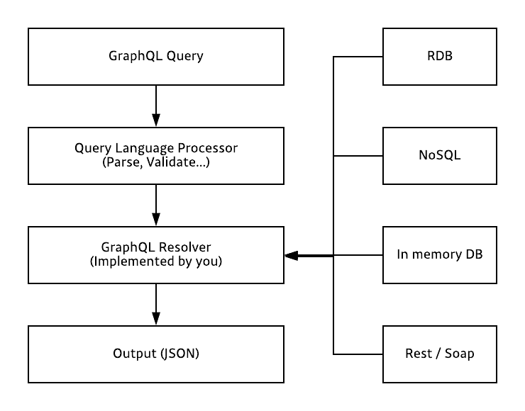

# GraphQL
GraphQL is query language made by Facebook. These days the developers talk about GraphQL each other. But it's still in the early-stage because it isn't many GraphQL API as OPen API.

## 1. What is GraphQL?
### 1-1. GraphQL이란?
GraphQL(gql)은 Structed Query Language(sql)와 마찬가지로 쿼리 언어이다. 하지만 sql은 데이터베이스 시스템에 저장된 데이터를 효율적으로 가져오는 것이 목적인 반면, gql은 웹 클라이언트가 데이터를 서버로부터 효율적으로 가져오는 것을 목적으로 한다.
이러한 차이점은 활용 방법에서도 차이를 보인다. sql은 주로 백엔드 시스템에서 작성하고 호출하는 반면, gql은 주로 클라이언트 시스템에서 작성하고 호출한다.

서버 사이드 gql 어플리케이션은 gql로 작성된 쿼리를 입력으로 받아 쿼리를 처리한 결과를 다시 클라이언트로 돌려준다. HTTP API 자체가 특정 데이터베이스나 플랫폼에 종속적이지 않는 것 처럼 마찬가지로 gql 역시 어떤 특정 데이터베이스나 플랫폼에 종속적이지 않다.(심지어 네트워크 방식에도 종속되지 않는다.)

일반적으로 gql의 인터페이스간 송수신은 네트워크 레이어 L7의 HTTP POST 메서드와 웹소켓 프로토콜을 사용한다. 필요에 따라서는 얼마든지 L4의 TCP/UDP를 활용하거나 심지어 L2형식의 이더넷 프레임을 사용할 수도 있다.

### 1-2. REST API와 비교
REST API는 URL, METHOD등을 조합하기 때문에 다양한 Endpoint가 존재한다. 반면, gql은 단 하나의 endpoint만 있으면 된다. gql은 endpoint에 종속되는 것이 아니라 요청할 때 사용하는 쿼리에 따라 다른 응답을 받을 수 있기 때문이다. 또한 정해진 응답값만 받아올 수 있는 REST API와 달리 GraphQL은 쿼리 작성을 통해 필요한 데이터만 받아올 수 있다.

## 2. Why those use GraphQL?

### 2-1. HTTP 요청 횟수를 줄일 수 있다.
RESTful의 경우 필요한 리소스 별로 요청을 해야하고, 필요한 데이터들이 부분적으로 나눠서 개발되어 있다면 그만큼 요청 횟수가 늘어난다. 하지만 GraphQL은 원하는 정보를 하나의 쿼리에 모두 담아 요청할 수 있다.

### 2-2. HTTP 응답 사이즈를 줄일 수 있다.
RESTful의 경우 응답의 형태가 정해져있기 때문에 필요한 정보만 부분적으로 요청하는 것이 힘들고, 자연스럽게 데이터의 사이즈가 클 수 밖에 없다. Facebook이 GraphQL을 개발한 초기 이유 중 하나는 모바일 사용의 증가이다. GraphQL을 사용함으로써 응답 데이터 사이즈를 최소화하여 모바일 환경의 부담을 줄일 수 있다.

### 2-3. 프론트 엔드와 백엔드 개발자의 부담을 덜 수 있다.
RESTful API를 사용한다면 프론트엔드 개발자는 API의 request/response 형식에 의존하게 된다. 따라서 새로운 엔드포인트를 효율적이게 개발하기 위해서는 프론트엔드와 백엔드 개발자의 커뮤니케이션이 강제되는 경우가 많다. 그러나 GraphQL은 request/response 의존도가 많이 없기 때문에, 개발자들이 API 개발 부담을 덜 수 있다.

## 3. What is the problem of GraphQL?

- 고정된 요청과 응답만 필요할 때에는 query로 인해 요청의 크기가 RESTful 보다 더 커질 수 있다.
- 캐싱이 REST보다 복잡하다.
- 파일 업로드 구현 방법이 정해져 있지 않아 직접 구현해야한다.

## 4. How to use the GraphQL?