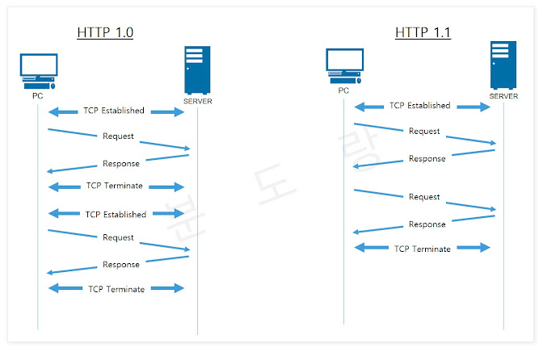
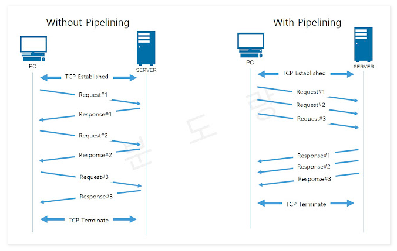
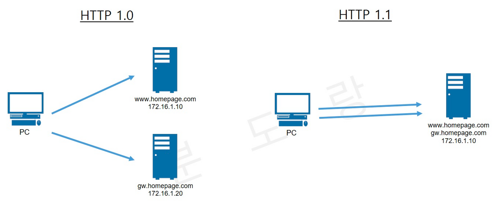
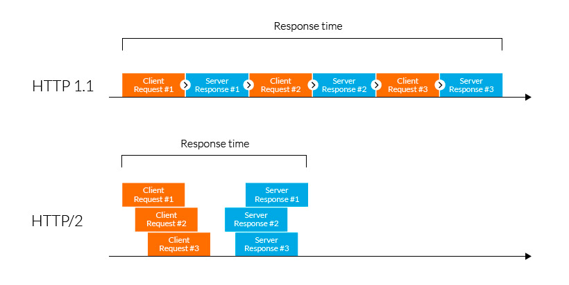
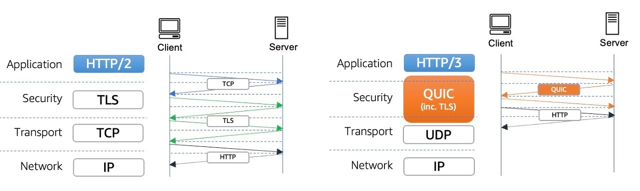

# HTTP, Hyper Text Transfer Protocol

## 1. HTTP/1.0
HTTP는 텍스트 기반의 통신 규악으로 인터넷에서 데이터를 주고받을 수 있는 프로토콜이다.  
TCP/IP 5계층에서 Application Layer에 속하는 프로토콜이다.  

### 1-1. HTTP의 동작
클라이언트 측에서 브라우저를 통해 어떤 서비스를 요청(request)하면, 서버측에서 해당 요청사항에 맞는 결과물을 사용자에게 응답(response)하는 형태로 동작한다. 

### 1-2.  HTTP의 특징
HTTP는 연결 상태를 유지하지 않는 비연결성 프로토콜이다. 때문에 요청/응답 방식으로 동작한다. 또한 HTTP 통신을 하는 서버는 클라이언트의 요청에 대한 정보를 유지하지 않는다.

### 1-3. HTTP 요청의 종류(Requset Method)
- GET: 자료의 조회를 요청하는 메소드
- POST: 자료의 생성을 요청하는 메소드
- PUT: 자료의 수정을 요청하는 메소드
- DELETE: 자료의 상제를 요청하는 메소드

### 1-4. RTT(Round-Trip Time)
RTT는 작은 packet이 클라이언트에서 서버로 이동했다가 다시 돌아오는 왕복 시간을 의미한다.

## 2. HTTP/1.1

### 2-1. HTTP/1.0 vs HTTP/1.1
HTTP/1.0과 HTTP/1.1의 가장 큰 차이점은 연결의 지속성이다. HTTP는 기본적으로 TCP를 이용하여 통신한다. 이때 HTTP/1.0은 TCP 세션을 유지하지 않고(non-persistent HTTP), HTTP/1.1은 TCP 세션을 유지한다(persistent HTTP)는 차이가 있다.

1.0은 TCP 세션을 유지하지 않기 때문에 매번 데이터를 요청하고 수신할 때마다 새로운 TCP 세션을 맺어야 한다. 그러나 1.1은 TCP 세션을 유지하기 때문에 한 번의 TCP 세션에 여러 개의 요청을 보내고 응답을 수신할 수 있다.

따라서 1.1은 TCP 세션 처리 부하를 줄이고 응답속도를 개선할 수 있다는 장점이 있다.  

### 2-2. 파이프라이닝(Pipelining)
파이프라이닝은 송신자가 다수의 패킷을 한번에 보내는 것을 말한다. stop and wati protocol은 ACK신호를 받을 때까지 기다리다가 ACK 신호를 받고 나서 다음 데이터를 보내야 한다. 그러나 pipelined protocol은 ACKs 신호를 받지 않아도 패킷 여러개를 보낼 수 있다.
(HTTP/1.0은 파이프라이닝을 제공하지 않고 HTTP/1.1만 파이프라이닝 기능을 제공한다.)  

### 2-3. 호스트 헤더(Host Header)
HTTP/1.0은 하나의 IP 주소에 여러 개의 도메인을 운영할 수 없었다. 따라서 도메인 별로 IP를 구분해서 준비해야 하기 때문에 서버의 개수가 늘어나야 했다. 하지만 HTTP/1.1은 가상 호스팅(Virtual Hosting)이 가능해졌기 때문에 하나의 IP주소에 여러 개의 도메인을 적용시킬 수 있다.  

### 2-4. 향상된 인증 절차(Improved Authentication Procedure)
HTTP/1.1에서 부터 proxy-authentication과 proxy-authorization 2가지 헤더가 추가되어 인증 절차가 향상되었다.

## 3. HTTP/2.0

### 3-1. HTTP/2.0의 장점 - 빠른 속도
HTTP/2.0은 HTTP/1.1 버전의 성능 향상에 초점을 맞춘 프로토콜이다. 인터넷 프로토콜 표준의 대체가 아닌 확장으로써, HTTP/1.1의 성능 저하 부분과 비효율적인 것들을 개선하여 탄생했다.  

HTTP/1.1 까지는 한 번에 하나의 파일만 전송이 가능했다. 비록 파이프라이닝 기술이 있었지만, 여러 파일을 전송할 경우 선행하는 파일의 전송이 늦어지면 HOLB(Head of Line Blocking)이 발생했다. 따라서 HTTP/2.0에서는 이 문제를 해결하기 위해 여러 파일을 한번에 병렬로 전송한다. 그래서 일반적으로 HTTP/2.0을 사용만해도 웹 응답 속도가 HTTP/1.1에 비해 15% ~ 50% 향상된다고 한다. 

### 3-2. HTTP/2.0의 단점

#### 여전한 RTT
아무리 개선되었다 하더라도 HTTP/2.0은 TCP를 이용하기 때문에 Handshake의 RTT로 인한 지연 시간(Latency)이 발생한다.

#### TCP 자체의 HOLB
기본적으로 TCP는 패킷이 유실되거나 오류가 있을 때 재전송하는데, 이 재전송 과정에서 패킷의 지연이 발생하면 결국 HOLB 문제가 발생된다.

## 4. HTTP/3.0
HTTP/2.0의 단점은 결국 TCP를 이용하는 것에서 온다. 따라서 HTTP/3.0은 TCP대신 UDP를 개조한 QUIC라는 프로토콜을 사용한다. 기존 TCP는 클라이언트와 서버 간에 세션을 설정하기 위해 핸드쉐이크가 필요하며, 인증서인 TLS도 세션이 보호되도록 자체 핸드셰이크도 필요하다. 하지만 QUIC는 보안 세션을 설정하기 위해 한 번의 핸드 셰이크만 필요하다.

