# Network

# 1. 네트워크 첫 걸음

## 1-1. 네트워크의 구조

-   네트워크(Network): Net + Work의 합성어로 그물처럼 서로 연결된 관계를 지칭
-   인터넷(Inetnet): 전세계의 큰 컴퓨터 네트워크부터 작은 컴퓨터 네트워크까지 연결하는 거대한 네트워크
-   패킷(Packet): 컴퓨터 간의 데이터를 주고받을 때 네트워크를 통해 흘러가는 작은 데이터 조각
-   대역폭(Bandwidth): 네트워크에서 이용 가능한 최대 전송 속도로 정보를 전송할 수 있는 단위 시간당 전송량
-   큰 데이터를 그대로 보내면 그 데이터가 네트워크의 대역폭을 너무 많이 점유해서 다른 패킷의 흐름을 막을 위험이 있어 패킷단위로 쪼개서 전송
-   송신부에서 쪼개서 전송한 패킷에는 번호표가 붙어있어서 수신부에서 패킷을 번호대로 재조합하는 과정 필요

## 1-2. LAN과 WAN

-   LAN(Local Area Network): 건물이나 특정 지역을 범위로 하는 근거리 네트워크
    범위가 좁은 대신 속도도 빠르고 오류도 적다
-   WAN(Wid Area Network): SK, KT, LG같은 인터넷 서비스 제공자(ISP)의 서비스를 이용하여 지리적으로 넓은 범위에 구축된 네트워크
    범위가 넓은 대신 속도가 느리고 오류가 상대적으로 많다

## 1-3. 가정에서 하는 LAN 구성

-   가정 내 설치된 공유기로 내부 인터넷(사설망)을 구성, LAN
-   인터넷 서비스 제공자(ISP)로부터 인터넷 회선을 받아와서 WAN과 인터넷 공유기 연결

## 1-4. 회사에서 하는 LAN 구성

-   가정에서의 LAN과 다른 점은 외부에 공개하기 위한 DMZ(DeMilitarized Zone) 네트워크 영역이 존재
    (외부 네트워크) - (라우터) - (스위치) - (컴퓨터)

### 회사 서버가 운영되는 방식

-   **온프레미스(on-premise)**: 사내 또는 데이터 센터에 서버를 두고 운영하는 것
-   **클라우드(Cloud)**: 인터넷을 통해 소프트웨어나 하드웨어 등의 컴퓨팅 시스템을 제공하는 것

 
 
 

# 2. 네트워크의 기본 규칙

## 2-1. 네트워크의 규칙

-   프로토콜(Protocol): 컴퓨터 또는 전자기기 간의 원활한 통신을 위해 지키기로 약속한 규약
    프로토콜은 신호 처리법, 오류처리, 암호, 인증, 주소 등을 포함

## 2-2. OSI 모델과 TCP/IP 모델

### OSI 모델

-   과거 같은 회사 컴퓨터끼리만 통신이 가능하거나 케이블을 연결하는 커넥터도 회사마다 상이
-   공통으로 사용하는 표준 규격을 ISO에서 제정

| 계층  | 이름             | 설명                                                               |
| ----- | ---------------- | ------------------------------------------------------------------ |
| 7계층 | 응용 계층        | 이메일&파일 전송, 웹사이트 조회 등 애플리케이션에 대한 서비스 제공 |
| 6계층 | 표현 계층        | 문자 코드, 압축, 암호화 등의 데이터를 변환                         |
| 5계층 | 세션 계층        | 세션 체결, 통신 방식 결정                                          |
| 4계층 | 전송 계층        | 신뢰할 수 있는 통신을 구현                                         |
| 3계층 | 네트워크 계층    | 다른 네트워크와 통신하기 위한 경로 설정 및 논리 주소 결정          |
| 2계층 | 데이터 링크 계층 | 네트워크 기기간의 데이터 전송 및 물리 주소 결정                    |
| 1계층 | 물리 계층        | 시스템 간의 물리적인 연결과 전기 신호를 변환 및 제어               |

### TCP/IP 모델

-   응용 계층: OSI의 응용, 표현, 세션 계층
-   전송 계층: OSI의 전송 계층
-   인터넷 계층: OSI의 네트워크 계층
-   네트워크 접속 계층: OSI의 데이터 링크, 물리 계층

## 2-3. 캡슐화와 역캡슐화

-   헤더: 데이터를 전송하려면 데이터 전송을 위해 필요한 정보를 앞에 하나씩 붙여서 다음 계층으로 보냄
-   캡슐화: 데이터 앞에 하나씩 헤더를 붙여나가는 과정
-   역캡슐화: 데이터를 받는 쪽에서는 헤더를 하나씩 제거하는 과정  
    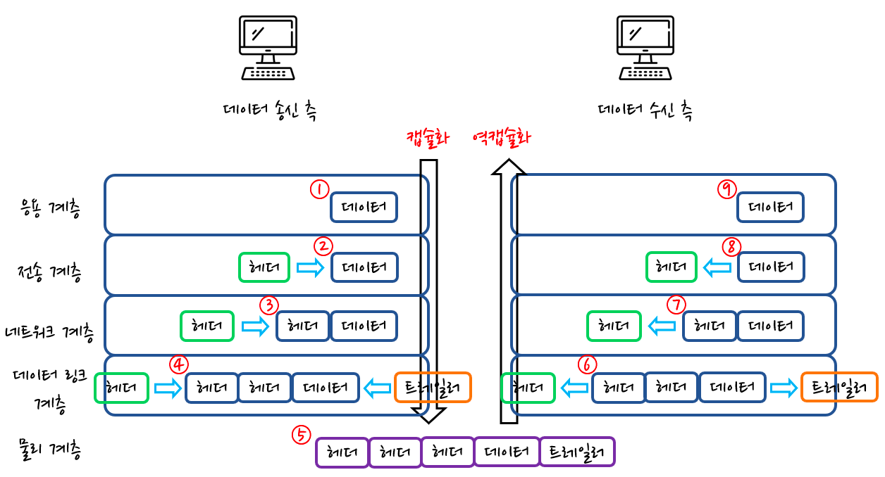  
    (1) 송신 컴퓨터에서 웹 사이트에 접속하려고하면 응용 계층에서 요청 데이터를 생성해서 전송계층에 전달  
    (2) 전송 계층에서는 신뢰할 수 있는 통신이 이루어지도록 응용 계층에서 만들어진 데이터에 헤더 붙임  
    (3) 전송 계층에서 만들어진 데이터를 다른 네트워크와 통신하기 위해 네트워크 계층에서 헤더를 또 붙임  
    (4) 네트워크 계층에서 만들어진 데이터를 물리적 통신 채널에 연결하기 위해 데이터 링크 계층에서 헤더와 트레잉러를 붙임  
    \*트레일러: 데이터를 전달할 때 마지막에 추가하는 정보  
    (5) 데이터 링크 계층에서 만들어진 데이터는 최종적으로 전기 신호로 변환돼서 수신 컴퓨터에 도착  
    (6) 수신측은 각 계층의 헤더를 제거하면서 데이터를 상위 계층으로 전달(역캡슐화)

 
 
 

# 3. 물리 계층 : 데이터를 전기 신호로 변환하기

물리 계층은 0과 1만으로 이루어진 비트열을 전기 신호로 변환하기 위해서 필요

## 3-1. 물리 계층의 역할과 랜 카드의 구조

### 전기신호

-   아날로그 신호: 시간에 따라 연속적으로 변화는 신호 (전화 회선이나 라디오 방송에 사용)
-   디지털 신호: 단순히 0과 1값만 인식하는 비연속, 이산 시간 신호

### 랜 카드

0과 1의 비트열 데이터는 전기신호로 변환하는 장치

## 3-2. 케이블의 종류와 구조

-   네트워크 전송 매체: 데이터가 흐르는 물리적인 선로로 유선과 무선으로 나뉨
    -   유선: 트위스트 페어 케이블, 광케이블 등
    -   무선: 라디오파, 마이크로파, 적외선 등

### 트위스트 페어 케이블(랜 케이블)

-   UTP 케이블: 비차폐 연선, 구리 선 여덟 개를 두 개씩 꼬아 만든 네 쌍의 전선으로 실드로 보호되어 있지 않은 케이블 \*쉴드: 금속호일이나 금속의 매듭과 같은 것으로 외부에서 발생하는 노이즈를 막는 역할  
    \*\*노이즈: 데이터의 왜곡이나 분해로 인해 전송 매체에서 생기는 전자 신호
-   STP 케이블: 차페 연선, 두 개씩 꼬아 만든 선을 실드로 보호한 케이블
-   UTP는 쉴드로 보호되지 않아 노이즈의 영향을 받기 쉽지만 저렴하기 때문에 일반적으로 많이 사용되는 케이블
-   랜 케이블의 양쪽 끝에는 RJ-45라고 부르는 커넥터가 붙어 있는데 이 커넥터로 랜포트나 네트워크 기기에 연결

### 다이렉트 케이블과 크로스 케이블

-   다이렉트 케이블: 구리 선 여덟 개를 같은 순서로 커넥터에 연결한 케이블,
    컴퓨터와 스위치를 연결할 때 사용
-   크로스 케이블: 구리 선 여덟 개 중 한쪽 커넥터의 1번과 2번에 연결되는 구리 선을 다른 쪽 커넥터의 3번과 6번에 연결한 케이블,
    컴퓨터 간에 직접 랜 케이블로 연결할 때 사용
-   다이렉트 케이블과 크로스 케이블 모두 실제로는 1,2,3,6,번 구리 선을 사용, 나머지 선은 미사용
-   1번과 2번은 수신하는 역할, 3번과 6번은 송신하는 역할

## 3-3. 리피터와 허브의 구조

리피터와 허브는 물리 계층에서 동작하는 네트워크 장비

### 리피터

-   전기 신호를 정형(일그러진 전기 신호를 복원)하고 증폭하는 기능을 가진 네트워크 중계 장비
-   과거 통신하는 상대방이 멀리 있을 때 사용, 그러나 최근 다른 네트워크 장비가 리피터 기능을 지원하여 미사용

### 허브

-   허브는 리피터와 마찬가지로 전기 신호를 정형하고 증폭하는 기능 + 여러 대를 서로 연결하는 기능
-   전기 신호가 허브에 도착하는 동안 노이즈 영향으로 파형이 변경될 때 허브가 그 파형을 정상으로 되돌리는 것
-   허브는 포트(실제로 통신하는 통로)를 여러개 가지고 있어 컴퓨터 여러대와 통신 가능
-   단, 허브는 어떤 특정 포트로부터 데이터를 받으면 해당 포트를 제외한 나머지 모든 포트로도 받은 데이터를 전송
    (때문에 스위치라는 네트워크 장치 사용)

 
 
 

# 4. 데이터 링크 계층 : 랜에서 데이터 전송하기

## 4-1. 데이터 링크 계층의 역할과 이더넷

-   데이터 링크 계층은 네트워크 장비 간에 신호를 주고받는 규칙을 정하는 계층, LAN에서 데이터를 주고 받기 위해 필요
-   이더넷(Ethernet): LAN에서 적용되는 규칙, 허브와 같은 장비에 연결된 컴퓨터와 데이터를 주고 받을 때 사용
    (보내려는 목적지 정보를 추가해서 허브에 보내면 나머지 컴퓨터들은 자기께 아니면 무시하도록 규정)
-   CSMA/CD: 여러 컴퓨터가 동시에 데이터를 보낼 때 충돌을 방지하기위해 이더넷 시점을 늦추는 방법
    -   CS: 데이터를 보내려고 하는 컴퓨터가 케이블에 신호가 흐르고 있는지 아닌지 확인하는 규칙
    -   MA: 케이블에 데이터가 흐르고 있지 않다면 데이터를 보내도 좋다는 규칙
    -   CD: 충돌이 발생하고 있는지 확인하는 규칙
-   최근에는 효율이 좋지 않다는 이유로 CSMA/CD를 거의 사용하지 않음, 대신 스위치 사용

## 4-2. MAC 주소(물리 주소)의 구조

-   랜카드에는 MAC 주소라는 번호가 정해져 있음, 제조할 때 정해지고 **전 세계에서 유일한 번호로 할당**
-   MAC 주소는 48비트의 숫자로 구성되는데 앞의 24비트는 랜 카드를 만드는 제조사번호, 뒤의 24비트는 일련번호
-   OSI 모델에서는 데이터 링크계층, TCP/IP 모델에서는 네트워크 계층에서 이더넷 헤더와 트레일러를 붙임
-   이더넷 헤더: 목적지의 MAC 주소(6Byte), 출발지 MAC 주소(6Byte), 이더넷 유형(2Byte)로 구성
-   이더넷 유형: 이더넷으로 전송되는 상위 계층 프로토콜의 종류를 16진수로 나타냄  
    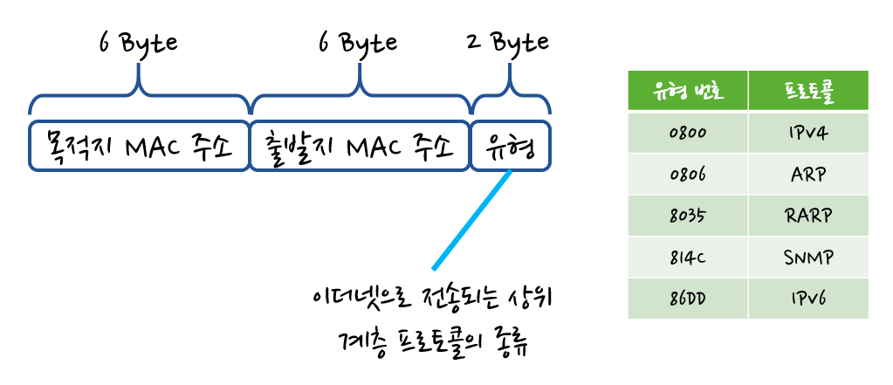
-   트레일러(FCS, Frame Check Sequence): 데이터 전송 도중에 오류가 발생하는지 확인하는 용도
-   프레임: 이더넷 헤더와 트레일러가 추가된 데이터, 네트워크를 통해 프레임이 전송되는 것  
    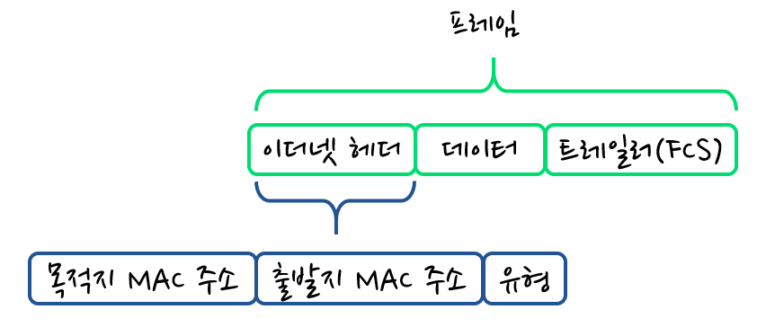(목적지 MAC주소) - (출발지 MAC주소) - (유형) - (데이터) - (트레일러)

? ARP(Address Resolution Protocol): 목적지 컴퓨터의 IP 주소를 이용하여 MAC 주소를 찾기위한 프로토콜  
ARP 요청: 출발지 컴퓨터가 목적지 주소를 모르면 MAC 주소를 알아내기 위해 네트워크에 브로드캐스트를 하는 것  
ARP 응답: ARP 요청에 대해 지정된 IP주소를 가진 컴퓨터는 MAC 주소를 응답으로 보내는 것  
ARP 테이블: 출발지 컴퓨터가 위 과정으로 MAC 주소를 얻은 후 MAC 주소와 IP 주소의 매핑 정보를 메모리에 보관하고 일정기간이 지나면 삭제

## 4-3. 스위치의 구조

스위치는 허브와 달리 데이터 충돌이 발생하지 않음 (외형은 허브와 비슷)

-   스위치 데이터 링크 계층에서 동작하고 레이어 2 스위치 또는 스위칭 허브라고도 불림
-   스위치: 내부에 MAC 주소 테이블이 존재
    MAC 주소 테이블: 스위치의 포트 번호와 해당 포트에 연결되어 있는 컴퓨터의 MAC 주속 등록되는 데이터베이스  
    (1) 스위치 전원을 켠 상태에서는 MAC 주소 테이블에 아무것도 등록되어 있지 않음
    (2) 송신 컴퓨터에서 목적지 MAC 주소가 추가된 프레임이 전송되면 MAC 주소테이블을 확인
    (3) MAC 주소 학습 기능: 송신 MAC 주소가 등록되어 있지 않으면 MAC 주소를 포트와 함께 등록
    (4-1) 플러딩(홍수): 수신 컴퓨터의 MAC 주소가 아직 등록되어 있지 않은 경우 송신 포트 이외의 포트에 프레임이 전달
    (4-2) MAC 주소 필터링: 수신 컴퓨터의 MAC 주소가 등록되어 있는 경우 해당 컴퓨터에게만 프레임 전달

## 4-4. 데이터가 케이블에서 충돌하지 않는 구조

### 전이중 통신과 반이중 통신

-   전이중 통신 방식: 데이터의 송수신을 동시에 통신하는 방식
-   반이중 통신 방식: 회선 하나로 송신과 수신을 번갈아가면서 통신하는 방식
-   컴퓨터 두 대를 랜 케이블로 연결하면 전이중 통신 방식 사용
-   허브로 연결하면 허브 내부에는 송수신이 나뉘어져있지 않아 반이중 통신 방식 사용
-   스위치는 충돌이 일어나지 않는 구조로 되어있어 전이중 통신 방식 사용

### 충돌 도메인

-   총돌 도메인: 충돌이 발생한 경우 그 영향이 미치는 범위
    (허브에서 충돌이 발생한 경우 허브에 연결된 모든 컴퓨터가 충돌 도메인 범위)

 
 
 

# 5. 네트워크 계층 : 목적지에 데이터 전달하기

## 5-1. 네트워크 계층의 역할

전 세계에는 수많은 네트워크가 있고 그 네트워크들이 서로 연결되어 거대한 인터넷을 이룸

### 네트워크 간의 연결 구조

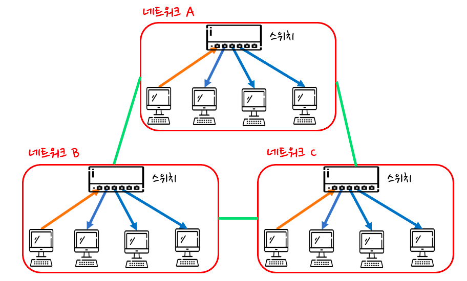

-   데이터 링크 계층에서 스위치와 이더넷 규칙으로 같은 네트워크에 있는 컴퓨터로는 데이터를 전송할 수 있지만,  
    인터넷이나 다른 네트워크로는 데이터를 전송할 수 없음, 새로운 규칙과 장비가 필요
-   IP주소: 다른 네트워크 간에 네트워크를 식별할 수 있는 주소,
    어떤 네트워크에 어떤 컴퓨터인지 구분할 수 있도록 하는 주소
-   라우터: 데이터의 목적지가 정해지면 해당 목적지까지 어떤 경로로 가는 것이 좋은지 알려주는 장치
-   라우팅: 목적지 IP 주소까지 어떤 경로로 데이터를 보낼지 결정하는 것
-   라우팅 테이블: 경로 정보를 등록하고 관리하는 테이블

### IP

-   네트워크 계층에서는 캡슐화할 때 IP 헤더를 붙임  
    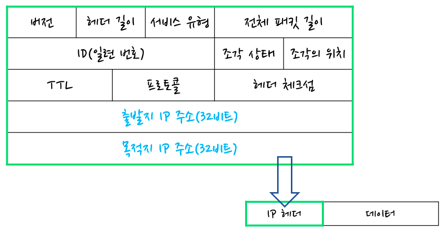
-   데이터를 정확하게 전달하기 위해 필요한 정보 포함(출발지 IP 주소와 목적지 IP 주소가 포함되어 있음)
-   IP 패킷: IP 프로토콜을 사용하여 데이터 앞에 IP 헤더를 붙여 캡슐화한 것

## 5-2. IP 주소의 구조

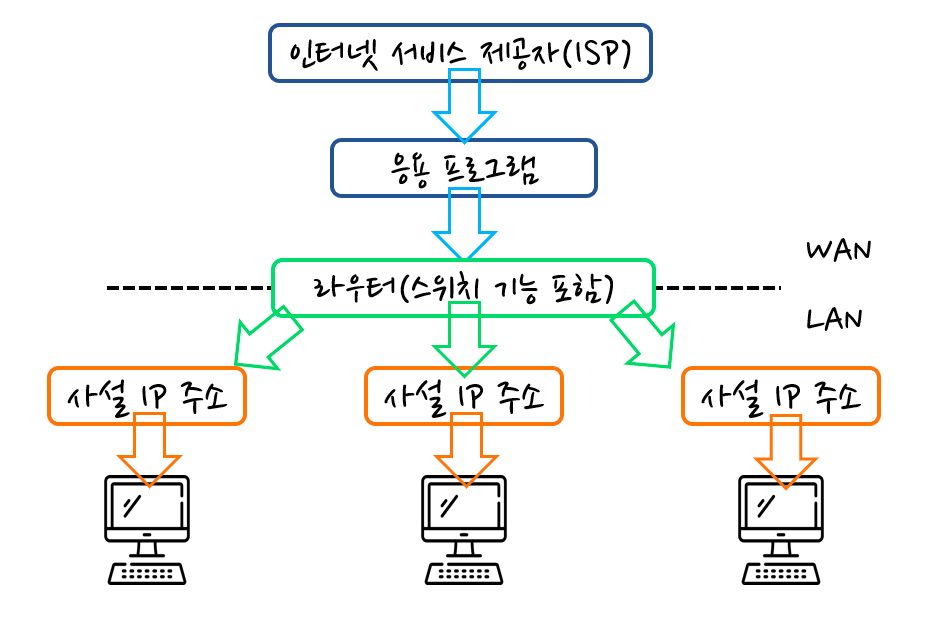

-   공인 IP 주소: 인터넷에 직접 연결되는 컴퓨터나 라우터에 할당(인터넷 서비스 제공자가 제공)
-   사설 IP 주소: 회사나 가정의 LAN에 있는 컴퓨터에 할당
-   LAN 안에 컴퓨터가 여러대 있다면, 할당할 수 있는 공인 IP 주소의 수가 제한되므로 한대당 부여하기 어려움  
    이런 경우 우선 공인 IP 주소는 라우터에만 할당하고  
    LAN 안에 있는 컴퓨터에는 LAN의 네트워크 관리자가 사설 IP를 할당하거나  
    라우터의 DHCP 기능을 사용하여 주소를 자동으로 할당  
    \*DHCP(Dynamic Host Configuration Protocol): IP 주소를 자동으로 할당하는 프로토콜
-   옥텟(Octet): 사람이 읽기 쉽게 8bit 단위로 나눠서 표시할 때 한 단위, IPv4는 32bit이므로 4옥텟으로 표시 가능
-   IP 주소에는 네트워크 ID와 호스트 ID가 존재
    -   네트워크 ID: 어떤 네트워크인지 나타냄
    -   호스트 ID: 해당 네트워크의 어느 컴퓨터인지 나타냄

### IPv4

### IPv6

## 5-3. IP 주소의 클래스 구조

-   IP 주소는 네트워크 규모에 따라 A~E 클래스로 나뉨

| 클래스 이름 | 내 용                 |
| ----------- | --------------------- | ---------------------------------------- |
| A 클래스    | 대규모 네트워크 주소  | 첫 8bit가 네트워크 ID, 나머지 호스트 ID  |
| B 클래스    | 중형 네트워크 주소    | 첫 16bit가 네트워크 ID, 나머지 호스트 ID |
| C 클래스    | 소규모 네트워크 주소  | 첫 24bit가 네트워크 ID, 나머지 호스트 ID |
| D 클래스    | 멀티캐스트 주소       |                                          |
| E 클래스    | 연구 및 특수용도 주소 |                                          |

### A 클래스

-   1 옥텟의 범위는 00000001 ~ 01111111으로 1 ~ 127
-   전체범위는 1.0.0.0 ~ 127.255.255.255

### B 클래스

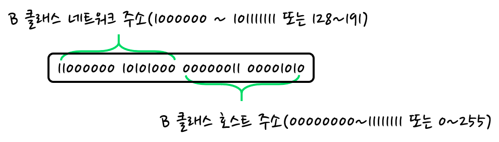

-   1 옥텟의 범위는 10000000 ~ 10111111으로 128 ~ 191
-   전체 범위는 128.0.0.0 ~ 191.255.255.255

### C 클래스

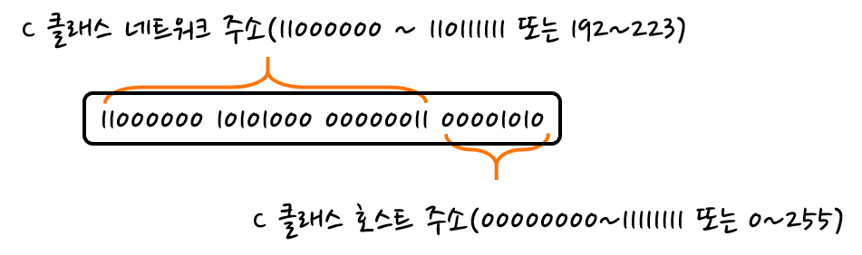

-   1 옥텟의 범위는 11000000 ~ 110111111으로 192~223
-   전체 범위는 192.0.0.0 ~ 223.255.255.255

### 공인 IP 주소 범위

| 종류     | IP 주소 범위                  |
| -------- | ----------------------------- |
| A 클래스 | 1.0.0.0 ~ 9.255.255.255       |
|          | 11.0.0.0 ~ 126.255.255.255    |
| B 클래스 | 128.0.0.0 ~ 172.15.255.255    |
|          | 172.32.0.0 ~ 191.255.255.255  |
| C 클래스 | 192.0.0.0 ~ 192.167.255.255   |
|          | 192.169.0.0 ~ 233.255.255.255 |

### 사설 IP 주소 범위

| 종류     | IP 주소 범위                  |
| -------- | ----------------------------- |
| A 클래스 | 10.0.0.0 ~ 10.255.255.255     |
| B 클래스 | 172.16.0.0 ~ 172. 31.255.255  |
| C 클래스 | 192.168.0.0 ~ 192.168.255.255 |

## 5-4. 네트워크 주소와 브로드캐스트 주소의 구조

-   네트워크 주소와 브로드캐스트 주소는 컴퓨터나 라우터가 자신의 IP로 사용하면 안되는 주소
-   두 주소는 컴퓨터에서 설정할 수 없음

### 네트워크 주소

-   호스트 ID가 10진수로 0이고, 2진수로 00000000인 주소
-   전체 네트워크에서 작은 네트워크를 식별하는데 사용, 그 네트워크 전체를 대표하는 주소가 됨

### 브로드캐스트 주소

-   호스트 ID가 10진수로 255고 2진수로 11111111인 주소
-   네트워크 안에 있는 모든 컴퓨터나 장비에게 데이터 전송할 때 사용되는 전용 IP 주소

## 5-5. 서브넷의 구조

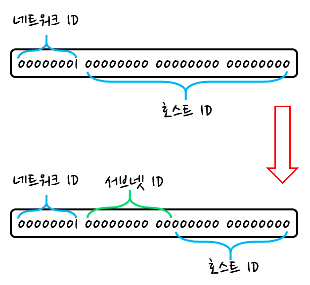

-   서브넷팅: 네트워크를 분할하는 것
-   서브넷: 분할된 네트워크
-   A 클래스의 대규모 네트워크를 작은 네트워크로 분할하여 브로드캐스트로 전송되는 패킷의 범위를 줄일 수 있음
-   서브넷팅을 하게되면 기존의 네트워크 ID와 호스트 ID로 구성되어 있던 IP주소가
    **호스트 ID의 일부분을 네트워크 ID로 빌려와서 서브넷 ID로 사용**하면서 네트워크 ID, 서브넷 ID 그리고 호스트 ID로 구성됨
-   서브넷 마스크: 네트워크 ID와 호스트 ID를 식별하기 위한 값
    서브네팅하게되면 어디까지가 네트워크 ID이고 어디부터 호스트 ID인지 알기 어려워서 등장
-   프리픽스(prefix)표기법: 서브넷 마스크를 슬래시(/비트수)로 표현하는 표기법
    (맨 앞의 비트부터 1의 개수를 표기하는 방식)

## 5-6. 라우터의 구조

-   라우터(Router): 서로 다른 네트워크 간의 통신에 필요한 장치
-   라우터는 네트워크를 분리하는 기능 보유
-   허브나 스위치는 네트워크를 분리할 수 없어 모두 동일한 네트워크에 포함됨
-   기본 게이트웨이(default gateway): 라우터 구멍마다 IP를 정해서 네트워크의 출입구를 설정  
    (1) 컴퓨터는 다른 네트워크로 데이터를 보낼 때 어디로 전송해야할지 모름  
    (2) 자신의 네트워크가 할당된 라우터 IP 주소를 사용해 라우터로 데이터 전송  
    (3) 라우터는 라우팅 테이블에 등록된 정보를 바탕으로 최적의 경로를 찾아서 데이터 전송
-   라우팅: 경로 정보를 기반으로 현재의 네트워크에서 다른 네트워크로 최적의 경로를 통해 데이터를 전송하는 것
-   라우팅 테이블: 경로 정보가 등록되에 있는 테이블
-   라우팅 테이블 등록 방법
    -   네트워크 관라자 수동 등록: 소규모 네트워크에 적합
    -   네트워크 관리자 자동 등록: 대규모 네트워크에 적합
-   라우팅 프로토콜: 라우터 간에 라우팅 정보를 교환하기 위한 프로토콜  
    (RIP, OSPF, BGP)

 
 
 

# 6. 전송 계층 : 신뢰할 수 있는 데이터 전송하기

전송계층은 목적지에 신뢰할 수 있는 데이터를 전송하기 위해 필요

## 6-1. 전송 계층의 역할

-   물리 계층, 데이터 링크 계층, 네트워크 계층이 있으면 목적지에 데이터 전송 가능
-   하지만 데이터 손상이나 유실 가능성이 있어 전송 계층이 필요

### 전송 계층의 두 가지 역할

-   전송계층에는 오류를 점검하는 기능, 오류가 발생하면 데이터를 재전송하도록 요청
-   컴퓨터에게 전송받은 데이터를 어떤 어플리케이션으로 전달할지 식별해서 알려주는 기능

### 연결통신과 비연결 통신

-   전송 계층의 특징: 신뢰성/정확성, 효율성
-   신뢰성/정확성: 데이터를 목적지에 문제없이 전달하는 것  
    연결형 통신, TCP(Transmission Control Protocol)  
    데이터를 보낸다. 보내도된다. 보냈다. 받았다. 확인했다 처럼 서로 확인해 가면서 통신하는 방식
-   효율성: 데이터를 빠르고 효율적으로 전달하는 것
    비연결형 통신, UDP(User Datagram Protocol)
    데이터를 보낸다. 처럼 상대편을 확인하지 않고 일방적으로 데이터를 전송하는 방식
    (동영상을 보낼 때 주로 사용)

## 6-2. TCP의 구조

-   세그먼트(Segment): TCP 헤더가 붙은 데이터
-   TCP 헤더: TCP 전송을 할 때 붙이는 헤더  
    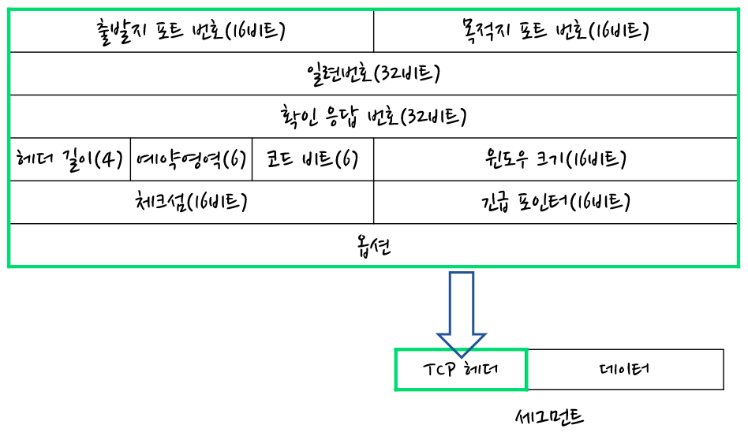
-   데이터를 전송하려면 먼저 연결(connection)이라는 가상의 독점 통신로를 확보해야함
-   예약과 윈도우 사이즈 사이에 있는 코드 비트는 TCP 헤더의 107번째 비트부터 112번째 비트까지의 6개의 비트  
    연결의 제어 정보가 기록되는 곳 (CWR/ECE/URG/ACK/PSH/RST/SYN/FIN)  
    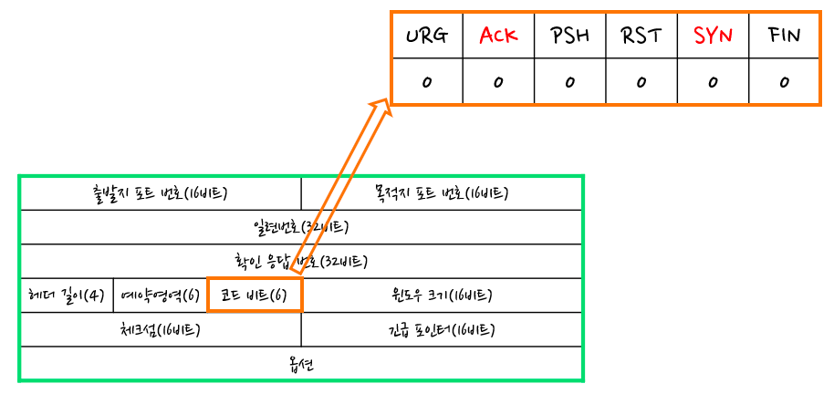
-   연결을 확립하려면 이 중 SYN(연결요청)과 ACK(확인 응답)가 필요

### 3-way 핸드셰이크 연결 요청

-   연결은 SYN과 ACK를 사용하여 확립, 신뢰할 수 있는 연결을 하려면 데이터를 전송하기 전에 패킷을 교환하는데 아래 그림 처럼 3번 확인  
    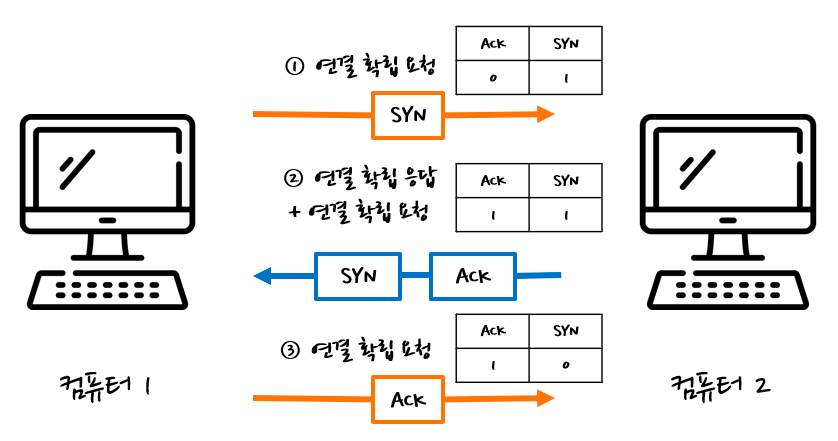  
    (1) 통신을 하려면 서버의 허가를 받아야하므로, 먼저 컴퓨터 1에서 컴퓨터 2로 연결 확립 허가를 위한 요청(SYN)을 전송  
    (2) 컴퓨터 2는 컴퓨터 1의 요청을 받은 후 허가한다는 응답을 하기 위해 연결 확립 응답(ACK)를 보냄과 동시에 연결 확립 요청 전송  
    (3) 컴퓨터 2의 요청을 받은 컴퓨터1은 컴퓨터 2에게 허가한다는 응답으로 연결확립 응답(ACK)를 전송

### 연결 종료

-   데이터 전송 후 연결을 끊기 위한 요청도 교환, 이때는 FIN(연결종료)과 ACK를 사용  
    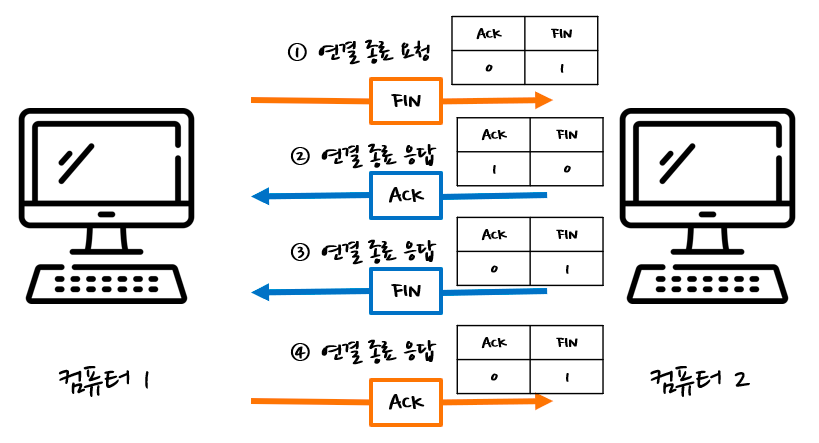

## 6-3. 일련번호와 확인 응답 번호의 구조

-   3-wqy 핸드쉐이크가 끝나고 실제 데이터를 보내거나 상대방이 받을 때는 일련번호(Sequence number)와 확인 응답 번호(Acknowledgement number)를 사용
-   일련번호: 송신 측에서 수신 측에 이 데이터가 몇 번째 데이터 인지 알려주는 역할
-   확인 응답 번호: 수신측이 몇 번째 데이터를 수신했는지 송신 측에 알려주는 역할, 이 다음 번호의 데이터를 요청하는데 활용  
    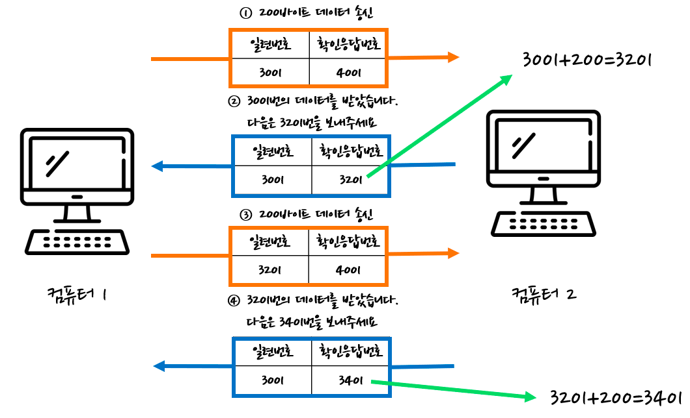  
    (1) 컴퓨터 1은 컴퓨터 2로 200Byte의 데이터를 전송  
    (2) 컴퓨터 2는 데이터를 수신하고 다음에 수신하고자 하는 데이터 번호를 응답번호에 넣음 (3001 + 200 이므로 3201 요청)  
    (3) 전송이 완료될 때 까지 반복
-   재전송 제어: 데이터가 항상 올바르게 전달되는 것은 아니므로 일련번호와 확인 응답번호를 사용해 데이터 손상이나 유실된 경우 재전송 요청
-   세그먼트(데이터) 하나를 보낼 때마다 응답을 한 번 반환하는 통신은 비효율적
-   대신 세그먼트를 연속해서 보내고 난 다음 확인 응답을 반환하면 효율적
-   버퍼: 수신 측에 세그먼트를 일시적으로 보관하는 장소
-   오버플로우: 수신 측에 대량으로 데이터가 전송되면 보관하지 못하고 넘쳐 흐르는 것
-   윈도우 크기: 오버플로우가 발생하지 않도록 버퍼의 한계 크기를 TCP 헤더에 적어둔 것, 윈도우 크기의 초기값은 3-way 핸드쉐이크를 할 때 판단
    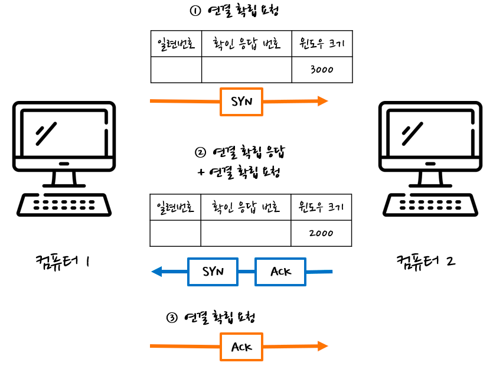
-   수신측의 윈도우 크기를 가지고 있으면 확인 응답을 받지 않고도 세그먼트를 연속적으로 전송 가능  
    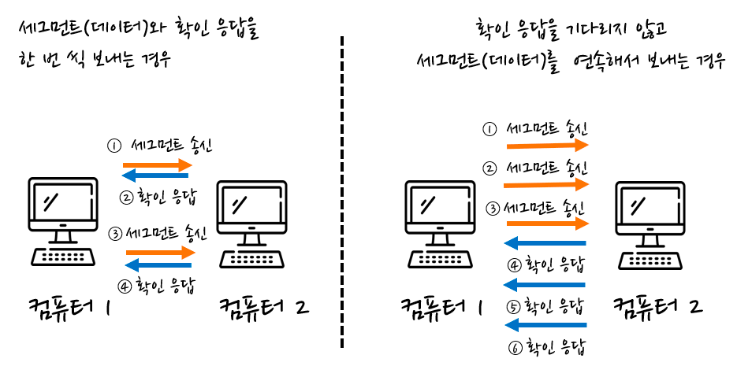

## 6-4. 포트 번호의 구조

-   포트번호: 데이터의 목적지가 어떤 프로그램인지 구분 (전송계층의 데이터의 목적지가 어디인지 구분하는 역할 담당)
-   TCP 헤더에 출발지 포트 번호와 목적지 포트번호가 있기 때문에 가능
-   포트 번호는 0 ~ 65535번 까지 사용, 그중 0 ~ 1023은 주요 프로토콜로 사용 예약이 되어 있음 (서버 측 애플리케이션에서 사용)
-   1024번은 사용되지 않는 포트이고, 1025번 이상은 랜덤 포트로 클라이언트 측의 송신 포트로 사용
-   웹 브라우저로 접속할 때 웹 브라우저에는 임의의 포트가 자동 할당  
    (서버 측에서는 포트 번호를 정해둬야하지만 클라이언트 측은 정하지 않아도 됨)

## 6-5. UDP의 구조

-   UDP는 비연결형 통신으로 신뢰성 보다는 효율성을 중시  
    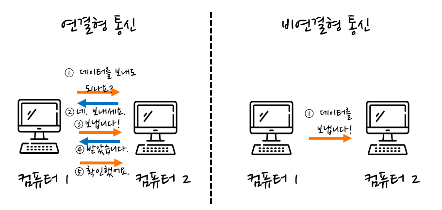
-   UDP 데이터 그램: UDP헤더가 붙은 데이터
-   UDP 헤더: 목적지에 데이터를 전송하기 위해 필요한 정보만 간략히 담겨 있음  
    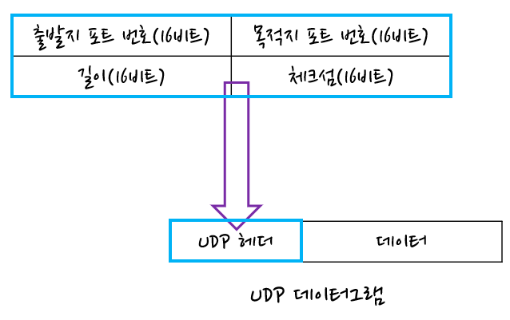
-   브로드캐스트: UDP를 사용해 같은 LAN에 있는 컴퓨터나 네트워크 장비에 데이터를 일괄로 보내는 것

 
 
 

# 7. 응용 계층 : 애플리케이션에 데이터 전송하기

응용 계층(세션 계층과 표현 계층 포함)은 애플리케이션과 데이터를 주고 받기 위해 필요

## 7-1. 응용 계층의 역할

-   응용 계층: 클라이언트의 요청을 전달하기 위해 통신 대상(서버 등)이 이해할 수 있는 메시지(데이터)로 변환하고 전송 계층으로 전달하는 역할
-   클라이언트 측 애플리케이션이 서버 측 애플리케이션과 통신하기 위해서 응용 계층의 프로토콜 사용  
    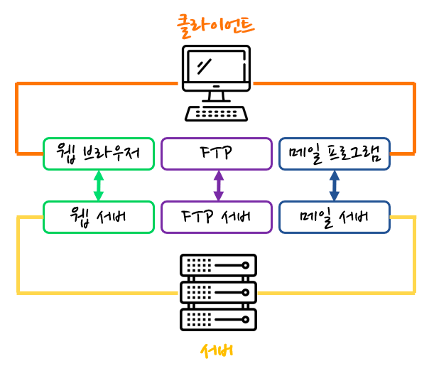

    | 프로토콜 | 내용           |
    | -------- | -------------- |
    | HTTP     | 웹 사이트 접속 |
    | DNS      | 이름 해석      |
    | FTP      | 파일 전송      |
    | SMTP     | 메일 송신      |
    | POP3     | 메일 수신      |

-   응용 계층은 각각의 애플리케이션에 대응되는 데이터를 전송하는 역할을 담당, 응용 계층에서 보내려는 데이터는 하위 계층 순서로 처리  
    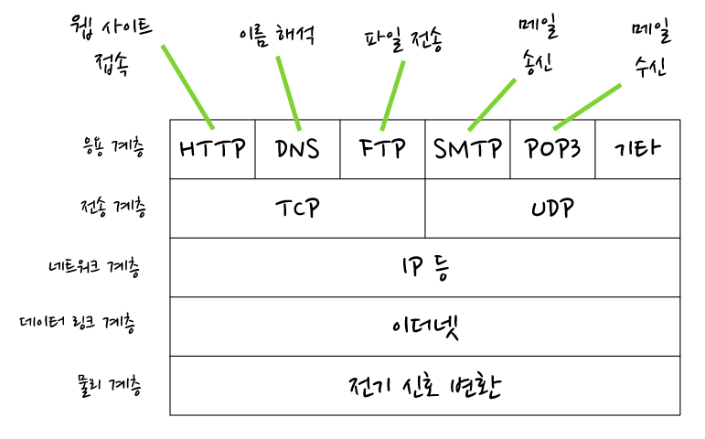

## 7-2. 웹 서버의 구조(웹 사이트 접속)

**WWW(W3, World Wide Web)** 는 HTML, URL, HTTP 3가지 기술을 사용

### HTML(Hyper Text Markup Language)

-   웹 페이지를 태그를 사용해서 구성하는 마크업 언어  
    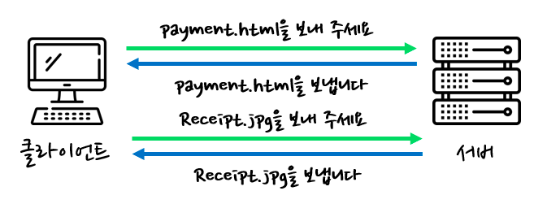  
    (HTML 문서와 이미지는 별도로 요청)

### HTTP(Hyper Text Transfer Protocol)

-   w3 상에서 정보를 주고 받을 수 있는 프로토콜(주로 HTML 문서 주고 받음)  
    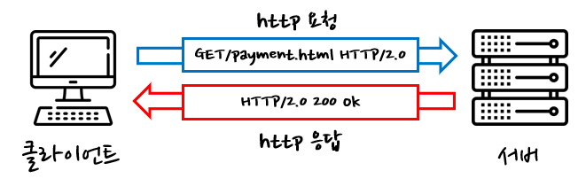
-   클라이언트는 웹 사이트를 보기 위해 80번 포트를 사용하여 HTTP 요청을 보내고
-   서버는 받은 요청을 기반으로 HTTP 응답을 반환

#### HTTP 버전

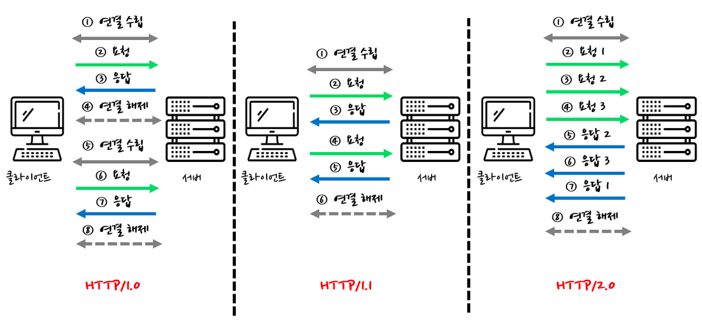

-   HTTP/1.0 버전: 요청을 보낼 때마다 연결했다가 끊는 작업 반복
-   HTTP/1.1 버전: keepalive라는 기능 추가로 연결을 한 번 수립하면 데이터 교환을 마칠 때 까지 유지하다가 교환이 끝나면 연결을 끊음, 요청을 순서대로 처리하는 특징도 있음
-   HTTP/2.0 버전: 1.1 버전이 요청을 순서대로 처리하다보니 앞의 요청이 길어지면 다음 요청 처리가 늦어지는 것을 보완해 요청 순서대로 반환하지 않음

### URL(Uniform Resource Locator)

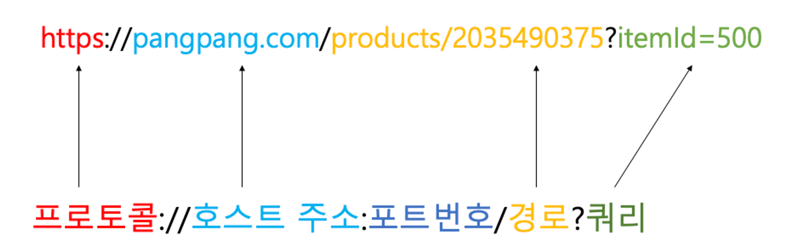

## 7-3. DNS 서버의 구조(이름 해석)

-   DNS: URL을 IP 주소로 변환해서 해당 웹사이트에 접속하게 해주는 서비스  
    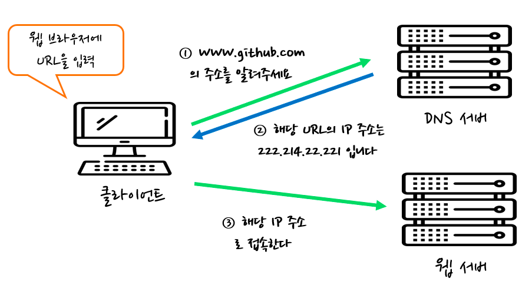
-   그러나 이름 해석 요청을 받은 DNS 서버가 해당 도메인을 모르는 경우 다른 DNS 서버로 재요청  
    DNS 서버는 전 세계에 흩어져 있고 모두 계층적으로 연결되어 있어서 연계하며 동작

## 7-4. 메일 서버의 구조

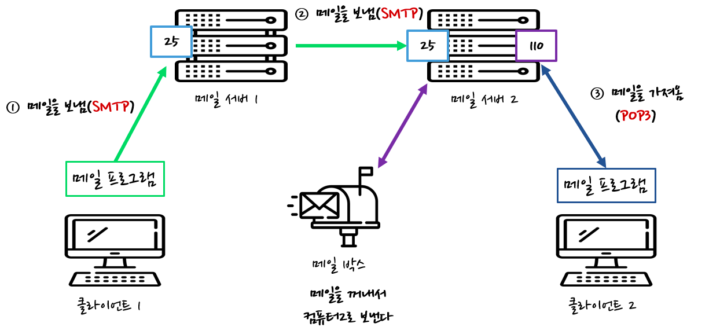

-   발신 클라이언트가 자신이 사용하는 메일 서버로 메일을 보면
-   해당 메일 서버는 수신 클라이언트 측이 받아볼 수 있는 메일 서버로 다시 재전송
-   재전송받은 수신측 메일 서버는 메일 박스에 메일을 보관
-   수신 클라이언트가 자신이 사용하는 메일 서버에 조회 요청을 보내면
-   수신측 메일 서버에서 보관된 메일 박스에서 메일을 가져와서 반환

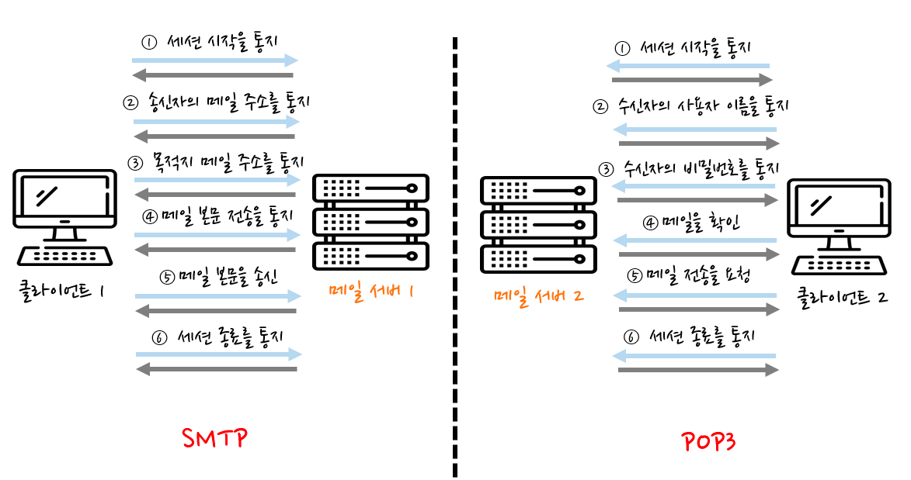
