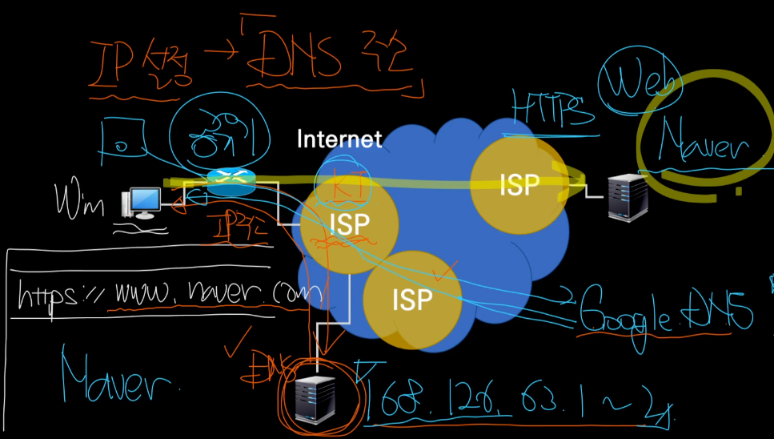

# DNS, Domain Name System

### 분산 구조형 데이터베이스 
- 도메인 네임(example.com)을 이용해서 IP 주소를 찾아준다.
- 데이터베이스 시스템(DNS 네임서버)의 분산 구성
- 데이터의 영역별 구분(Domain Zone) 및 분산관리
- 도메인의 네임서버 및 도메인 데이터는 해당 관리주체에 의해 독립적으로 관리된다. 
####  

1. Win PC 사용자가 www.naver.com 접속을 시도한다.
2. ISP(ex. KT)에서 지정한 DNS 서버는 해당 도메인의 IP 주소와 유효기간을 알려준다.  
   - 유효기간이 지나면 다시 물어봐야 한다.
   - 전 세계에 RootDNS 가 13대 존재한다. 사실 KT DNS 는 Cache DNS 이다.  
   - KT DNS 도 모르는 정보는 RootDNS 에게 물어봐야 한다.
   - 그럼 RootDNS 는 com 을 담당하는 DNS 를 KT DNS 에게 알려주고,  
   - KT DNS 는 다시 그 com 을 담당하는 DNS 에게 물어본다. 
   - 임의로 다른 DNS 에게 요청할 수도 있지만 ISP 가 다르면 더 느리다.
3. Win 는 DNS 가 알려준 IP 주소로 접속한다.
- DNS Cache: PC 가 한 번이라도 DNS 에 질의를 했으면 memory 에 결과를 저장해서 가지고 있다.
- hosts file: DNS IP 주소랑 URL 기록하면 DNS 에 묻지 않고 여기에 기록된 대로 요청을 보낸다.

#### 도메인 네임 (naver.com)
- www: 은 naver 에 속하는 **호스트 네임**이다. 
- .naver: naver 는 com 에 속한다. 
- .com
- 즉 url www.naver.com 이란, naver.com 도메인에 속한 www 호스트를 찾는 것이다.

### 트리(Tree) 구조의 도메인 네임(Domain Name) 체계 
- Domain: 영역, 영토를 의미
- 도메인 네임의 자율적 생성
- 생성된 도메인 네임은 언제나 유일(Unique) 하도록 네임 체계 구성