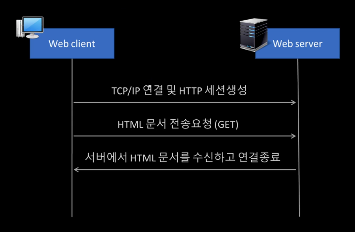
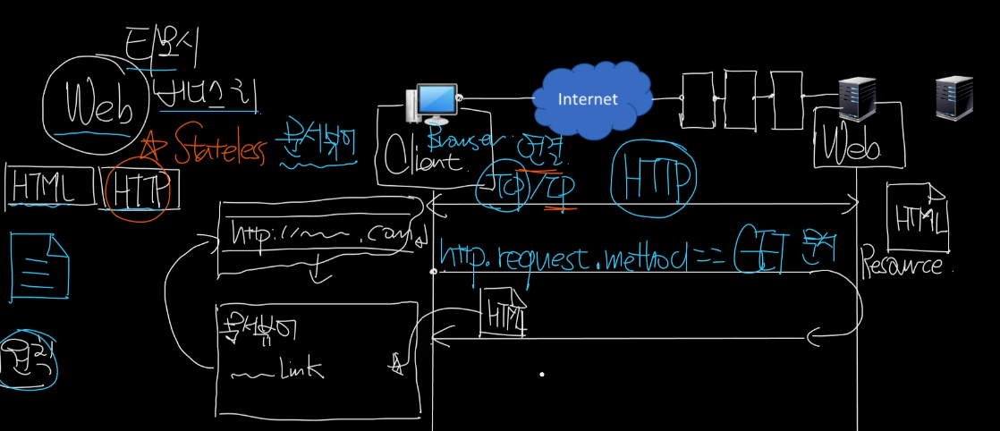
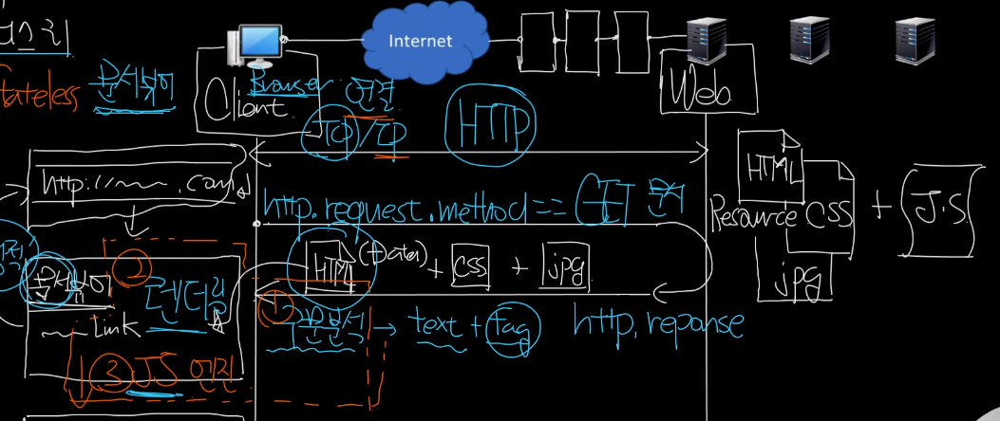
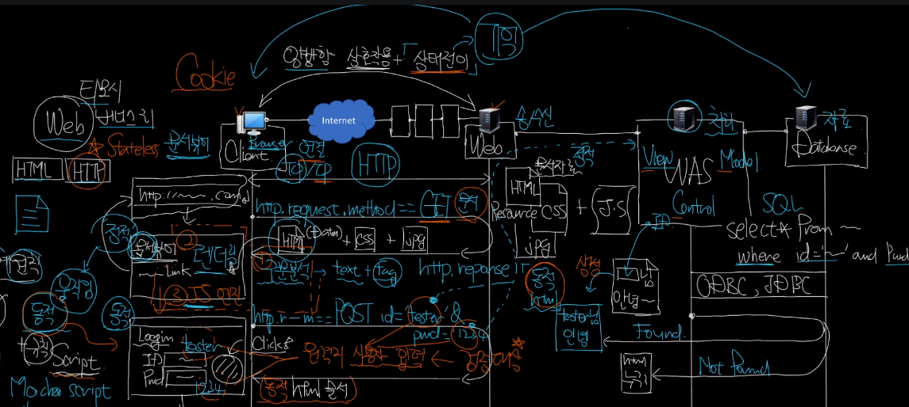

# Web Service

## 1. 웹 서비스 기본 구조 

### HTML

- HTTP Socket 은 스트림이고 이 스트림을 잘게 쪼개서 세그먼트나 패킷단위로 교환하지만   
  웹 서비스 차원에서는 세그먼트나 패킷은 언급하지 않고 HTTP 단위로 이야기한다.
- 기본은 클라이언트에서 HTML 문서를 서버에 요청하고, 서버로부터 받은 뒤 연결을 종료하는 것이다.
- 즉, HTML 이라는 문서를 HTTP 라는 프토콜로 주고 받는 것이다.  

### CSS
- 문서를 예쁘게 꾸미고 싶어서 CSS 를 따로 만들었다. 
- 이제는 HTML 뿐만 아니라 CSS 까지 한 번에 요청하게 되었다.

### JavaScript

- 정적 문서를 동적으로 만들고 싶어서(동적 움직임을 주는 규칙을 추가하고 싶어서) JavaScript 를 만들었다.
- 이제는 HTML + CSS + JavaScript 까지 한 번에 요청하게 되었다.
- 브라우저는 HTML 에서 tag 와 text 를 분석하는 구문 분석기(parser)와 화면에 렌더링할 렌더링 엔진만 필요지만,  
  JavaScript 의 추가로 JavaScript 엔진이 추가되었다.

### POST Request
- GET Request 는 다운로드적 성격이 강해서 서버로 무언가를 전달하기 어려워서 POST 요청을 만들었다.
- POST 의 등장으로 양방향 상호작용이 가능하게 되었다.
- 그런데 양방향 상호작용은 상태 전이를 필연적으로 내포하는데 HTTP 는 Stateless 라는 문제가 있었다.  
  (오늘 대화를 하다가 멈추고 내일 대화를 이어갈 때 처음부터 다시 대화하지 않고 이어서 대화하는 것처럼 어디까지 대화했는지 기억하는 것을 상태라 할 수 있다.)
- 그럼 그 상태 전이를 어딘가에 기억시켜야 하기 때문에 클라이언트에서는 쿠키의 형태로 기억을 하고,  
  서버는 기억해야할 것들이 많기 때문에 Database 형태로 만들어서 기억하게 되었다.
  - Cookie: 상호작용을 위한 기억의 부산물 

### WAS

- 클라이언트에서 id/pw 를 입력한다고 할때, 이 정보들은 '원격지 사용자 입력' 정보로 서버 입장에서는 검증의 대상이다.
- 바로 Database 에 요청을 보내는 것이 아니라 처리를 전담하는 서버를 통해서 요청을 보내고 응답을 받는다.
- 주로 이 처리를 담당하는 서버와 Database 는 ODBC, JDBC 등의 인터페이스를 사용해서 연결된다.
- 그리고 이 처리를 담당하는 서버 WAS 는 Database 에서 응답 받은 내용을 바탕으로 새로운 문서를 생성해서 반환하기도 한다.