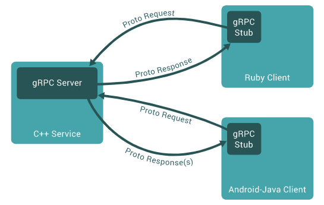

# gRPC(Communication Framework)

## 1. gRPC의 개념

### 1-1. RPC(Remote Procedure Calls)

다른 컴퓨터 프로그램의 프로시저를 실행하는 것을 허용하는 프로토콜이다. RPC를 사용하면 개발자가 원격 상호작용에 대한 세부 정보를 명시적으로 코딩하지 않아도 된다. 프레임워크가 자동으로 핸들링하기 때문이다.

### 1-2. gRPC

MSA에서는 서비스들 간의 소통이 필요하다. 그런데 마이크로 서비스 간에는 엄청나게 많은 수의 메세지가 교환되고, 빠른 소통이 필요하다. gRPC는 소통을 대신 해결해주어 개발자 핵심 로직 구현에만 집중할 수 있도록 해준다.

### 1-3. gRPC 작동원리

- 클라이언트에서 stub 생성 (서버랑 같은 메소드 제공)
- stub가 gRPC 프레임워크를 호출 (내부 네트워크를 통해서 호출)
- 클라이언트와 서버는 서로 상호작용을 위해 stubs 사용 (서로의 코어 서비스 로직의 권한만 필요)

### 1-4. Stub
RPC의 핵심 개념으로 Parameter 객체를 메세지로 마샬링/언마샬링하는 레이어이다.

서버와 클라이언트는 서로 다른 주소 공간을 사용하므로 함수 호출에 사용된 매개 변수를 꼭 변환해줘야한다. 그렇지 않으면 메모리 매개 변수에 대한 포인터가 다른 데이터를 가리키게 되기 때문이다.

클라이언트의 stub은 함수 호출에 사용된 파라미터의 변환(marshalling) 및 함수 실행 후 서버에서 전달된 결과의 변환을 담당한다. 서버의 stub은 클라이언트가 전달한 매개 변수의 역변환(unmarshalling) 및 함수 실행 결과 변환을 담당한다.

- 직렬화/역질렬화: 직렬화는 객체의 상태를 저장하기 위해 객첼르 바이트 스트림 형태로 변환하는 것이다.
- 마샬링/언마샬링: 마샬링은 객체의 메모리 구조에서 저장 또는 전송에 적합한 다른 데이터 형식을 변환하는 과정이다. 즉 마샬링은 프로그램간 이동할 때 사용하는 변환 과정이라고 할 수 있다.
  마샬링은 직렬화를 포함하는 더 큰 개념이기 때문에 직렬화가 가능한 객체는 마샬링 역시 가능하다.

### 1-5. Protocol Buffer
gRPC는 IDL(Interface Definition Language)로 protocol buffer를 사용한다.

protocol buffer는 직렬화 데이터 구조이다. 어떤 언어나 플랫폼에서도 통신 프로토콜이나 데이터를 저장할 때, 고조화된 데이터를 전환하게 해주는 방법이다. 직렬화의 중류에는 대표적으로 JSON과 XML이 있다.

프로토콜 버퍼로 작업을 할 때는 proto file에서 직렬화하려는 데이터 구조를 정의한다. 프로토콜 버퍼는 하나의 프로그래밍 언어가 아니라 여러 프로그래밍 언어를 지원하기 때문에, 특정 언어에 종속성이 없는 형태로 데이터 타입을 정의하게 되는데, 이 파일을 proto file이라고 한다.

포로토콜 버퍼 데이터는 일련의 '이름-값'의 쌍을 포함하는 작은 논리적 레코드인 메시지로 구성된다.

    // .prop 파일
    message Person {
        string name = 1;
        int32 id = 2;
        bool has_ponycopter = 3;
    }

이렇게 작성된 proto file을 protoc 컴파일러로 컴파일 하면 데이터에 접근할 수 있는 각 언어에 맞는 형태의 데이터 클래스를 생성해준다. 만들어진 클래스는 각 필드를 위한 접근자 뿐 아니라 전체 구조를 바이트로 직렬화하거나 바이트로부터 전체 구조를 파싱하는 메서드들을 제공한다.

### 1-6. gRPC - HTTP API 비교

| 기능               | gRPC                        | JSON을 사용하는 HTTP API    |
|------------------|-----------------------------|---------------------------|
| 계약              | 필수(.proto)                 | 선택사항(OpenAPI)           |
| 프로토콜           | HTTP/2 (빠름)                | HTTP                      |
| Payload          | Protobuf(소형, 이진메시지 형식) | JSON(대형, 사람이 읽을 수 있음) |
| 규범              | 엄격한 사양                   | 느슨함, 모든 HTTP가 유효       |
| 스트리밍           | 클라이언트, 서버, 양방향         | 클라이너트, 서버              |
| 브라우저 지원       | 아니요(gRPC-웹 필요)           | 예                         |
| 보안              | 전송(TLS)                    | 전송(TLS)                  |
| 클라이언트 코드 생성 | 예                           | OpenAPI + 타사도구          |

 
 

## 2. gRPC 사용하기

### 2-1. .NET side

#### Rider에서 프로젝트 생성

> File - New Solution - 검색: gRPC - Create

#### .prop 파일 작성

#### .proto 파일 컴파일

### 2-2. React side

    // gRPC 클라이언트 라이브러리 설치
    % npm install grpc-web

    // react-project-root src에 .proto 파일 생성

    // proto 컴파일러 설치
    % sudo apt update
    % sudo apt install protobuf-compiler
    % protoc --version

    // 프로토파일 컴파일 
    % protoc -I=프로토_디렉토리 --js_out=import_style=commonjs:출력_디렉토리 --grpc-web_out=import_style=commonjs,mode=grpcwebtext:출력_디렉토리 프로토_파일.proto
    (여기서 프로토_디렉토리는 .proto 파일이 있는 디렉토리를 나타내며, 출력_디렉토리는 생성된 JavaScript 파일을 저장할 디렉토리를 나타낸다.)  

    

## 3. SignalR과 gRPC 같이 사용하는 이유

### 3-1. SignalR
- HTTP 기반의 양방향 통신: SignalR은 웹 기술을 기반으로 하며, 웹 브라우저와 서버간의 양방향 통신을 구현하는데 사용된다. 주로 웹 애플리케이션에서 사용된다.
- 단순한 설정: SignalR은 브라우저에서 WebSocket을 사용하거나 다른 프레임워크를 통해 실시간 통신을 단순하게 설정할 수 있는 API를 제공한다.

### 3-2. gRPC
- 프로토콜 버퍼 기반: gRPC는 프로토콜 버퍼를 기반으로 이진 메시지 형식으로 통신하여 효율적인 직렬화 및 빠른 통신을 지원한다.
- 언어 중립성: gRPC는 여러 언어에서 사용할 수 있으며, 서버와 클라이언트 코드를 자동으로 생성해준다. 이는 서버와 클라이언트가 서로 다른 언어로 작성되어도 통신할 수 있는 장점을 제공한다.

### 3-3. 두 기술을 함께 쓰는 이유
- gRPC는 이진 프로토콜을 사용하여 효율적인 통신을 지원하고, 빠른 속도와 낮은 대역폭을 제공한다. 따라서 실시간 데이터 전송에 적합하다.
- SignalR은 웹 기반의 양방향 통신에 좋지만, 대량의 데이터를 처리하기에는 제한이 있을 수 있다.
- 웹, 모바일 앱, 데스크톱 앱 등 다양한 클라이언트에서 통신해야 할 때, SignalR과 gRPC를 함께 사용하여 각 플랫폼에 최적화된 통신을 구현할 수 있다.
- SignalR은 웹 애플리케이션에서의 실시간 통신을 위한 간단한 설정을 제공하므로, 웹 애플리케이션에서 사용할 때 유용하다.
- gRPC는 다양한 클라이언트 플랫폼 간의 효율적인 통신을 지원하므로 서비스간 통신에 적합하다.