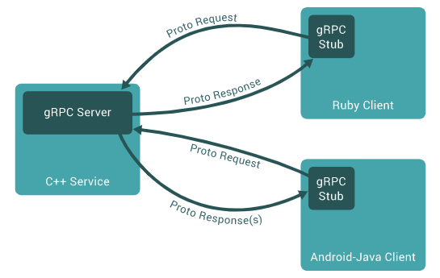

# gRPC

## 1. What is gRPC?
- gRPC 는 Google 에서 개발한 오픈소스 RPC 시스템이다.
- 분산 시스템에서 효율적인 통신을 위한 강력한 도구이다.
- 클라이언트 및 서버 간의 통신을 간소화하고 성능을 향상시킨다.

### 1-1. RPC(Remote Procedure Calls)
- 분산 시스템에서 원격으로 프로시저 호출을 수행하는 기술이다.  
- 이는 마치 로컬 함수 호출처럼 보이지만, 클라이언트와 서버 사이에 네트워크를 통해 이루어진다.
  - 프로시저: 프로그래밍에서 일련의 작업을 수행하기 위해 사용되는 코드 블록이나 서브 루틴이다.  
    특정 작업을 수행하기 위한 코드 모음이며 함수와 유사한 개념이지만 조금 다르다.

#### 1-2. HTTP/2 기반 통신 
- gRPC는 기본적으로 HTTP/2를 사용하며, 이는 단일 연결을 통해 다중 요청 및 응답을 처리할 수 있는 효율적인 프로토콜이다.   
- 이는 성능 및 효율성을 높이며, TCP 연결 오버헤드를 줄여줍니다. 

### 1-3. Protocol Buffers (ProtoBuf)
- Protocol Buffers 는 구조화된 데이터를 직렬화하기 위한 구글의 개방형 포멧이다.  
- 이는 데이터를 효율적으로 표현하고 직렬화 하게 해주며, 다양한 언어 간에 이식성을 제공한다.

### 1-4. 다양한 언어 및 플랫폼 지원 
- gRPC 는 여러 가지 언어 및 플랫폼에서 사용할 수 있다. 
- 공식적으로는 C, C++, C#, Java, Python, JS, PHP, Go, Ruby, Objective-C 를 지원한다.

### 1-5. 자동 코드 생성 
- gRPC 는 Protocol Buffers 를 사용하여 서비스와 메시지를 정의한다. 
- 이를 통해 클라이언트 및 서버 코드의 생성을 자동화할 수 있다.  
- 이는 개발자가 서비스 인터페이스에 집중할 수 있도록 돕는다.

### 1-6. 양방향 스트리밍 
- gRPC 는 양방향 스트리밍을 지원한다.
- gRPC 는 클라이언트와 서버 간에 데이터를 동시에 송수신할 수 있게 한다.
- 이는 실시간 통신 및 스트리밍 서비스에 유용하다.

 

## 2. 데이터 전송 
- gRPC 는 원격 프로시저 호출 시스템을 구현하기 위한 오픈 소스 프레임워크이다. 
- Protocol Buffers 를 사용하여 효율적으로 데이터를 전송한다.

### 2-1. 프로토콜 정의
- gPRC 서비스를 위한 프로토콜을 정의한다. 이를 통해 서비스의 메서드와 데이터 유형을 정의하고, Protocol Buffers 를 사용하여 메시지 형식을 정의한다.
  - protocol: 프로토콜은 특정한 통신 규약이나 규칙이다. 여기선 메시지 형식, 네트워크 전송방식, RPC 호출 방식 등의 통신 규칙을 정의한다.  
    이 프로토콜을 따르는 서버와 클라이언트는 서로 통신할 수 있게 되며, gRPC 프레임워크를 사용하여 이러한 통신을 구현할 수 있다.

### 2-2. 컴파일 
- 작성된 프로토콜 정의를 사용하여 gRPC 코드를 생성한다. 
- 이 코드에는 클라이언트 및 서버 측 stubs(스텁) 및 메시지 유형에 대한 코드가 포함된다. 
  - stubs: RPC 에서 클라이언트와 서버 간의 통신을 담당하는 프로그램 또는 코드 모듈을 말한다.  
    일반적으로 클라이언트 측 스텁과 서버 측 스텁 두 가지 종류가 있다.
    - (Client Stub) 클라이언트 측 스텁은 클라이언트에서 호출된 원격 메서드의 매개변수를 직렬화하여 네트워크를 통해 서버로 전송하고,  
      서버로부터 받은 응답을 역직렬화하여 클라이언트에 반환하는 역할을 한다.  
      클라이언트는 이 스텁을 호출하여 마치 로컬 함수를 호출하는 것 처럼 원격 서비스의 메서드를 호출할 수 있다.
    - (Serve Strub) 서버 측 스텁은 서버에서 클라이언트로부터 받은 요청을 받아들이고, 해당 요청을 처리하기 위한 메서드를 호출한다.  
      또한, 서버 측 스텁은 서버에서 생성된 결과를 직렬화하여 클라이언트로 보낸다.  
    
    스텁은 클라이언트와 서버 간의 통신을 추상화하고, 사용자가 실제 통신 상세를 신경쓰지 않고도 편리하게 RPC를 사용할 수 있게 한다.
- 이러한 스텁을 사용하여 클라이언트와 서버는 통신을 수행한다.

### 2-3. 클라이언트 요청 
- 클라이언트가 gRPC를 사용하여 서버에 요청을 보낸다. 이 요청은 Protocol Buffers 형식으로 직렬화되어 전송된다.

### 2-4. 네트워크 전송 
- 직렬화된 요청은 네트워크를 통해 서버로 전송된다. gRPC는 HTTP/2를 기본 프로토콜로 사용한다.
- 이는 다중화된 스트림을 통해 효율적인 통신을 간으하게 한다.

### 2-5. 서버 수신 및 처리 
- 서버는 요청을 수신하고, 직렬화된 데이터를 역직렬화하여 원래의 메시지 형식으로 변환한다. 
- 그런 다음 요청에 대한 적절한 처리를 수행하고, 결과를 생성한다.

### 2-6. 서버 응답 
- 서버는 처리된 결과를 다시 Protocol Buffers 형식으로 직렬화하여 클라이언트에게 응답을 보낸다.

### 2-7. 클라이언트 수신 및 처리 
- 클라이언트는 응답을 수신하고, 직렬화된 데이터를 역직렬화하여 결과를 추추랗ㄴ다.

### 2-8. 응답 처리
- 클라이언트는 서버로부터 받은 결과를 처리하고, 필요한 작업을 수행한다. 

### 2-9. 양방향 통신 
- 양방향 통신인 경우, 양쪽 모두가 동시에 클라이언트와 서버 역할을 수행한다. 
- 이것은 gRPC 가 전이중(full-duplex) 통신을 지원하기 때문에 가능하다.
- 클라이언트와 서버는 동시에 여러 개의 스트림을 열어서 서로 데이터를 주고 받는다.
- 이러한 방식으로 양방향 통신이 이루어진다.
  1. 클라이언트는 gRPC 를 사용하여 서버에 연결하고, 양방향 스트림을 연다.
  2. 클라이언트는 필요한 데이터를 전송하고, 동시에 서버로부터 데이터를 수신하기 위해 스트림을 유지한다.
  3. 서버도 마찬가지로 클라이언트에게 데이터를 보내고, 클라이언트로부터 데이터를 받기 위해 스트림을 연다.
  4. 양쪽 모두 데이터를 주고받으면서 필요한 작업을 수행한다.
  5. 이런식으로 클라이언트와 서버는 상호적으로 데이터를 주고받으며, 양방향 통신이 이루어진다.  
     따라서 gRPC 에서 양방향 통신을 위해 클라이언트와 서버는 서로 교차로 역할을 수행하게 된다.

 

## 3. Python - C# 
- 각 언어에는 gRPC 의 클라이언트 및 서버용 라이브러리가 있어 다른 언어로 작성된 클라이언트와 서버가 서로 통신할 수 있다.
- 이렇게 gRPC 는 서로 다른 언어 간에 효율적인 통신을 지원한다.

### 3-1. 서버 - 클라이언트
#### 서버
- 서버는 클라이언트의 요청을 받아들이고 처리한다.
- 일반적으로 서비스의 구현이 위치하며, 클라이언트 요청에 대한 응답을 생성한다.
- 서버는 서비스를 호스팅하고, 클라이언트로부터의 요청을 받아들이고 이에 따른 작업을 수행한다.

#### 클라이언트
- 클라이언트는 서버에 요청을 보내고 응답을 받는다.
- 일반적으로 클라이언트는 서비스의 사용자 또는 소비자이다.
- 클라이언트는 서버에 요청을 보내고, 서버의 응답을 받아 필요에 따라 처리한다.

#### 양방향 통신
- 양방향 통신에서는 클라이언트와 서버 모두 요청을 보내고 응답을 받을 수 있다. 
- 이런 양방향 통신은 스트리밍 RPC 를 통해 제공된다.

### 3-2. 라이브러리 설치 

    // Python
    % pip install grpcio grpcio-tools

    // gRPC C# 클라이언트 
    % dotnet add package Grpc.Net.Client
    % dotnet add package Google.Protobuf
    % dotnet add package Grpc.Tools

    // gRPC C# 서버 or 양방향
    % dotnet add package Grpc.AspNetCore

### 3-3. C#이 서버 Python이 클라이언트 

### 3-4. Python이 서버 C#이 클라이언트 

### 3-5. 양방향 

# gRPC(Communication Framework)

## 1. gRPC의 개념

### 1-1. RPC(Remote Procedure Calls)

다른 컴퓨터 프로그램의 프로시저를 실행하는 것을 허용하는 프로토콜이다. RPC를 사용하면 개발자가 원격 상호작용에 대한 세부 정보를 명시적으로 코딩하지 않아도 된다. 프레임워크가 자동으로 핸들링하기 때문이다.

### 1-2. gRPC

MSA에서는 서비스들 간의 소통이 필요하다. 그런데 마이크로 서비스 간에는 엄청나게 많은 수의 메세지가 교환되고, 빠른 소통이 필요하다. gRPC는 소통을 대신 해결해주어 개발자 핵심 로직 구현에만 집중할 수 있도록 해준다.

### 1-3. gRPC 작동원리

- 클라이언트에서 stub 생성 (서버랑 같은 메소드 제공)
- stub가 gRPC 프레임워크를 호출 (내부 네트워크를 통해서 호출)
- 클라이언트와 서버는 서로 상호작용을 위해 stubs 사용 (서로의 코어 서비스 로직의 권한만 필요)

### 1-4. Stub
RPC의 핵심 개념으로 Parameter 객체를 메세지로 마샬링/언마샬링하는 레이어이다.

서버와 클라이언트는 서로 다른 주소 공간을 사용하므로 함수 호출에 사용된 매개 변수를 꼭 변환해줘야한다. 그렇지 않으면 메모리 매개 변수에 대한 포인터가 다른 데이터를 가리키게 되기 때문이다.

클라이언트의 stub은 함수 호출에 사용된 파라미터의 변환(marshalling) 및 함수 실행 후 서버에서 전달된 결과의 변환을 담당한다. 서버의 stub은 클라이언트가 전달한 매개 변수의 역변환(unmarshalling) 및 함수 실행 결과 변환을 담당한다.

- 직렬화/역질렬화: 직렬화는 객체의 상태를 저장하기 위해 객첼르 바이트 스트림 형태로 변환하는 것이다.
- 마샬링/언마샬링: 마샬링은 객체의 메모리 구조에서 저장 또는 전송에 적합한 다른 데이터 형식을 변환하는 과정이다. 즉 마샬링은 프로그램간 이동할 때 사용하는 변환 과정이라고 할 수 있다.
  마샬링은 직렬화를 포함하는 더 큰 개념이기 때문에 직렬화가 가능한 객체는 마샬링 역시 가능하다.

### 1-5. Protocol Buffer
gRPC는 IDL(Interface Definition Language)로 protocol buffer를 사용한다.

protocol buffer는 직렬화 데이터 구조이다. 어떤 언어나 플랫폼에서도 통신 프로토콜이나 데이터를 저장할 때, 고조화된 데이터를 전환하게 해주는 방법이다. 직렬화의 중류에는 대표적으로 JSON과 XML이 있다.

프로토콜 버퍼로 작업을 할 때는 proto file에서 직렬화하려는 데이터 구조를 정의한다. 프로토콜 버퍼는 하나의 프로그래밍 언어가 아니라 여러 프로그래밍 언어를 지원하기 때문에, 특정 언어에 종속성이 없는 형태로 데이터 타입을 정의하게 되는데, 이 파일을 proto file이라고 한다.

포로토콜 버퍼 데이터는 일련의 '이름-값'의 쌍을 포함하는 작은 논리적 레코드인 메시지로 구성된다.

    // .prop 파일
    message Person {
        string name = 1;
        int32 id = 2;
        bool has_ponycopter = 3;
    }

이렇게 작성된 proto file을 protoc 컴파일러로 컴파일 하면 데이터에 접근할 수 있는 각 언어에 맞는 형태의 데이터 클래스를 생성해준다. 만들어진 클래스는 각 필드를 위한 접근자 뿐 아니라 전체 구조를 바이트로 직렬화하거나 바이트로부터 전체 구조를 파싱하는 메서드들을 제공한다.

### 1-6. gRPC - HTTP API 비교

| 기능               | gRPC                        | JSON을 사용하는 HTTP API    |
|------------------|-----------------------------|---------------------------|
| 계약              | 필수(.proto)                 | 선택사항(OpenAPI)           |
| 프로토콜           | HTTP/2 (빠름)                | HTTP                      |
| Payload          | Protobuf(소형, 이진메시지 형식) | JSON(대형, 사람이 읽을 수 있음) |
| 규범              | 엄격한 사양                   | 느슨함, 모든 HTTP가 유효       |
| 스트리밍           | 클라이언트, 서버, 양방향         | 클라이너트, 서버              |
| 브라우저 지원       | 아니요(gRPC-웹 필요)           | 예                         |
| 보안              | 전송(TLS)                    | 전송(TLS)                  |
| 클라이언트 코드 생성 | 예                           | OpenAPI + 타사도구          |

 
 

## 2. gRPC 사용하기

### 2-1. .NET side

#### Rider에서 프로젝트 생성

> File - New Solution - 검색: gRPC - Create

#### .prop 파일 작성

#### .proto 파일 컴파일

### 2-2. React side

    // gRPC 클라이언트 라이브러리 설치
    % npm install grpc-web

    // react-project-root src에 .proto 파일 생성

    // proto 컴파일러 설치
    % sudo apt update
    % sudo apt install protobuf-compiler
    % protoc --version

    // 프로토파일 컴파일 
    % protoc -I=프로토_디렉토리 --js_out=import_style=commonjs:출력_디렉토리 --grpc-web_out=import_style=commonjs,mode=grpcwebtext:출력_디렉토리 프로토_파일.proto
    (여기서 프로토_디렉토리는 .proto 파일이 있는 디렉토리를 나타내며, 출력_디렉토리는 생성된 JavaScript 파일을 저장할 디렉토리를 나타낸다.)  

    

## 3. SignalR과 gRPC 같이 사용하는 이유

### 3-1. SignalR
- HTTP 기반의 양방향 통신: SignalR은 웹 기술을 기반으로 하며, 웹 브라우저와 서버간의 양방향 통신을 구현하는데 사용된다. 주로 웹 애플리케이션에서 사용된다.
- 단순한 설정: SignalR은 브라우저에서 WebSocket을 사용하거나 다른 프레임워크를 통해 실시간 통신을 단순하게 설정할 수 있는 API를 제공한다.

### 3-2. gRPC
- 프로토콜 버퍼 기반: gRPC는 프로토콜 버퍼를 기반으로 이진 메시지 형식으로 통신하여 효율적인 직렬화 및 빠른 통신을 지원한다.
- 언어 중립성: gRPC는 여러 언어에서 사용할 수 있으며, 서버와 클라이언트 코드를 자동으로 생성해준다. 이는 서버와 클라이언트가 서로 다른 언어로 작성되어도 통신할 수 있는 장점을 제공한다.

### 3-3. 두 기술을 함께 쓰는 이유
- gRPC는 이진 프로토콜을 사용하여 효율적인 통신을 지원하고, 빠른 속도와 낮은 대역폭을 제공한다. 따라서 실시간 데이터 전송에 적합하다.
- SignalR은 웹 기반의 양방향 통신에 좋지만, 대량의 데이터를 처리하기에는 제한이 있을 수 있다.
- 웹, 모바일 앱, 데스크톱 앱 등 다양한 클라이언트에서 통신해야 할 때, SignalR과 gRPC를 함께 사용하여 각 플랫폼에 최적화된 통신을 구현할 수 있다.
- SignalR은 웹 애플리케이션에서의 실시간 통신을 위한 간단한 설정을 제공하므로, 웹 애플리케이션에서 사용할 때 유용하다.
- gRPC는 다양한 클라이언트 플랫폼 간의 효율적인 통신을 지원하므로 서비스간 통신에 적합하다.